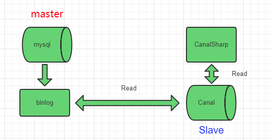
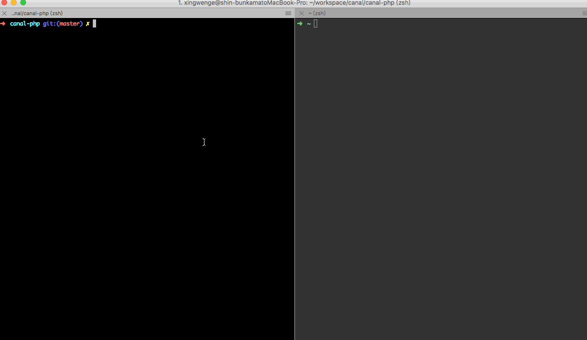

# canal-php

## 一.canal-php 简介

canal-php 是阿里巴巴开源项目 [Canal](https://github.com/alibaba/canal)是阿里巴巴mysql数据库binlog的增量订阅&消费组件 的 php 客户端。为 php 开发者提供一个更友好的使用 Canal 的方式。Canal 是mysql数据库binlog的增量订阅&消费组件。

基于日志增量订阅&消费支持的业务：

1. 数据库镜像
2. 数据库实时备份
3. 多级索引 (卖家和买家各自分库索引)
4. search build
5. 业务cache刷新
6. 价格变化等重要业务消息

关于 Canal 的更多信息请访问 https://github.com/alibaba/canal/wiki

## 二.应用场景

canal-php 作为Canal的客户端，其应用场景就是Canal的应用场景。关于应用场景在Canal介绍一节已有概述。举一些实际的使用例子：

1.代替使用轮询数据库方式来监控数据库变更，有效改善轮询耗费数据库资源。

2.根据数据库的变更实时更新搜索引擎，比如电商场景下商品信息发生变更，实时同步到商品搜索引擎 Elasticsearch、solr等

3.根据数据库的变更实时更新缓存，比如电商场景下商品价格、库存发生变更实时同步到redis

4.数据库异地备份、数据同步

5.根据数据库变更触发某种业务，比如电商场景下，创建订单超过xx时间未支付被自动取消，我们获取到这条订单数据的状态变更即可向用户推送消息。

6.将数据库变更整理成自己的数据格式发送到kafka等消息队列，供消息队列的消费者进行消费。

## 三.工作原理

canal-php  是 Canal 的 php 客户端，它与 Canal 是采用的Socket来进行通信的，传输协议是TCP，交互协议采用的是 Google Protocol Buffer 3.0。

## 四.工作流程

1.Canal连接到mysql数据库，模拟slave

2.canal-php 与 Canal 建立连接

2.数据库发生变更写入到binlog

5.Canal向数据库发送dump请求，获取binlog并解析

4.canal-php 向 Canal 请求数据库变更

4.Canal 发送解析后的数据给canal-php

5.canal-php收到数据，消费成功，发送回执。（可选）

6.Canal记录消费位置。



## 五.快速启动

### 安装Canal

Canal 的安装以及配置使用请查看 https://github.com/alibaba/canal/wiki/QuickStart


### 构建canal php客户端

````shell
$ composer require xingwenge/canal_php

or

$ git clone https://github.com/xingwenge/canal-php.git
$ cd canal-php
$ composer update
````

### 建立与Canal的连接

````php
try {
    $conn = new CanalConnector();
    $conn->connect("127.0.0.1", 11111, 10, 1800, 1800);
    $conn->checkValid();
    $conn->subscribe("example", ".*\\..*");

    while (true) {
        $message = $conn->get(10);
        $entries = $message->getEntries();
        if ($entries) {
            foreach ($entries as $entry) {
                Fmt::println($entry);
            }
        }
        sleep(1);
    }

    $conn->disConnect();
} catch (\Exception $e) {
    echo $e->getMessage(), PHP_EOL;
````




更多详情请查看 [Sample](https://github.com/xingwenge/canal-php/blob/master/src/sample/socket.php)

